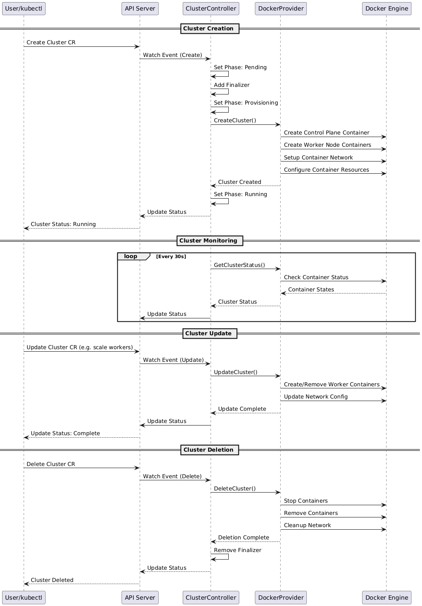

# Mini Kubernetes Cluster Management Tool

## Overview
Mini-K8s-Manager is a comprehensive tool for managing Kubernetes clusters, designed to facilitate the creation, scaling, and monitoring of clusters using Docker-based providers. This project aims to provide an extensible framework for managing Kubernetes clusters with custom controllers and providers.

## High-Level Packages

### 1. **pkg/api/v1alpha1**
Contains the API definitions and types for the Kubernetes clusters, including CRDs (Custom Resource Definitions) and their specifications.

### 2. **pkg/providers**
Implements various providers for managing cluster resources. Currently includes:
- `docker_provider.go`: Manages Docker-based clusters.
- `mock_provider.go`: Provides a mock implementation for testing purposes.

### 3. **pkg/controllers**
Contains the controllers responsible for reconciling the state of the clusters, handling lifecycle events, and ensuring that the actual state matches the desired state defined in the CRDs.

### 4. **cmd/manager**
The entry point for the application, responsible for setting up the controller manager and initializing the necessary components.

### 5. **deploy**
Contains deployment configurations and manifests for deploying the Mini-K8s-Manager.

### 6. **examples**
Provides example configurations and usage scenarios for the Mini-K8s-Manager.

## Sequence Diagram
The following sequence diagram illustrates the flow of creating and managing a Kubernetes cluster:



## Development Environment Setup with Devbox

To work with the Mini-K8s-Manager project, you need to use the Devbox shell for an isolated development environment. Follow these steps:

1. **Install Devbox**: If you haven't already installed Devbox, run the following command:
   ```bash
   curl -fsSL https://get.jetpack.io/devbox | bash
   ```

2. **Initialize Devbox**: Navigate to the project directory and initialize Devbox:
   ```bash
   cd /path/to/mini-k8s-manager
   devbox init
   ```

3. **Enter Devbox Shell**: Launch the Devbox shell to start working on the project:
   ```bash
   devbox shell
   ```

4. **Run Commands**: Inside the Devbox shell, you can run Go commands, tests, and other development tasks as needed.

5. **Unset GOROOT**: If you encounter issues with the Go environment, make sure to unset the GOROOT variable:
   ```bash
   unset GOROOT
   ```

6. **Exit Devbox Shell**: When you're done, simply type `exit` to leave the Devbox shell.

## Getting Started
To get started with the Mini-K8s-Manager, clone the repository and follow the setup instructions in the `TODOLIST.md` file.
